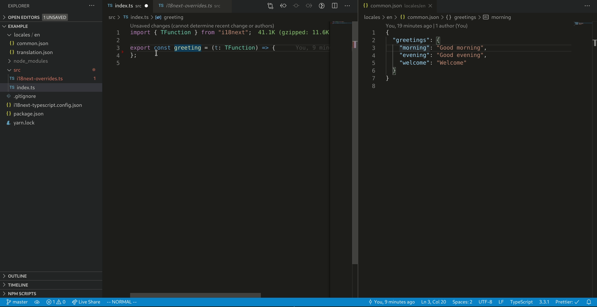

## i18next-typescript

Stronger type support for [i18-next](https://github.com/i18next/i18next)

### What does it do?

- Provides a CLI tool to extract all your translations keys, exporting them as a typescipt type definition. Includes support for nested keys and namespaces.
- Provides type definitions to override types like `TFunction` to provide strong type support for translation keys.



### How to use?

```
Usage: i18next-typescript generate|g [options]

Generate type definitions for all your translation keys.

Options:
  -i, --in [inFolder]                     Path to a folder with your translation files
  -o, --out [outFile]                     Path to the output file
  --default-namespace [defaultNamespace]  Default Namespace in your i18next configuration (default: "translation")
  --indent [indent]                       Indentation level of output file (default: "2")
  --type-name [typeName]                  Exported type name in the generated file (default: "TranslationKeys")
  --quote-char [quoteChar]                Character to use to quote strings (default: "'")
  -c, --config [configFile]               Path to config file (default: "i18next-typescript.config.json")
  -h, --help                              display help for command
```

```
Usage: i18next-typescript watch|w [options]

Watch your translation files and generate type definitions for all your translations keys when they change.

Options:
-i, --in [inFolder]                    Path to a folder with your translation files
-o, --out [outFile]                    Path to the output file
--default-namespace [defaultNamespace] Default Namespace in your i18next configuration (default: "translation")
--indent [indent]                      Indentation level of output file (default: "2")
--type-name [typeName]                 Exported type name in the generated file (default: "TranslationKeys")
--quote-char [quoteChar]               Character to use to quote strings (default: "'")
-c, --config [configFile]              Path to config file (default: "i18next-typescript.config.json")
-h, --help display help for command
```

While all options can be provided through the command line, it's recommended to use a configuration file like the one below in your root folder:

```json
{
  "inFolder": "public/locales/en",
  "outFile": "app/src/i18next.keys.ts",
  "defaultNs": "translation",
  "indent": 2,
  "typeName": "TranslationKeys",
  "quoteChar": "'"
}
```

Only `inFolder` and `outFile` are required. Minimal configuration:

```
{
  "inFolder": "public/locales/en",
  "outFile": "app/src/i18next.keys.ts",
}
```

To leverage the auto-generated types, override and re-export the `TFunction` and/or `WithT`.

```typescript
// e.g. /app/src/i18next-overrides.ts

import { TypedTFunction } from "i18next-typescript";
import { TranslationKeys } from "./i18next.keys.ts";

export type TFunction = TypedTFunction<TranslationKeys>;

// e.g. /app/src/index.ts

import { TFunction } from "./i18next-overrides.ts";

// calling 't' will now autocomplete and complain if you use a key which doesn't exist
const greeting = (t: TFunction) => t("common:greeting.evening");
```

Run `i18next-typescript` watch to automatically update the auto-generated types whenever you make changes to your translation files.

### Run an example

- Check out this repository
- Install dependencies: `yarn` or `npm install`
- Run the translation file watcher: `yarn example:watch` or `npx run example:watch`
- Change on of the translation files in `example/locales`
- Observe changes to the type definitions in `example/i18next.keys.d.ts`

### Bindings for specific languages

- React: [ react-i18next-typescript ](https://github.com/LFDM/react-i18next-typescript)
